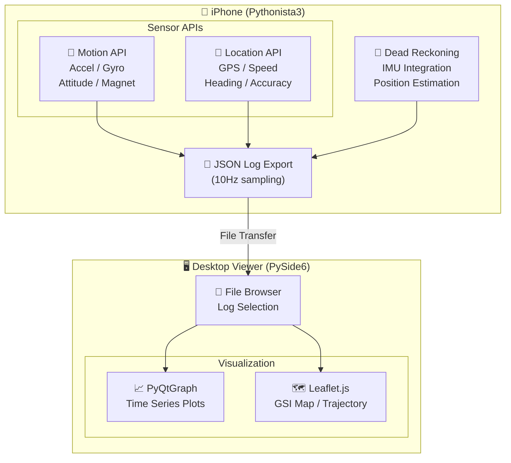

# iPhone G-Sensor Logger & Viewer

iPhoneのモーションセンサー（加速度計、ジャイロスコープ、磁力計）とGPSを使用した高精度センサーログ記録・可視化システム

## Demo

### Sensor Logger (iPhone - Pythonista3)

https://github.com/user-attachments/assets/8bcaa9ff-bb84-4976-832b-16496f7f16e1

**機能:**
- 加速度・ジャイロ・姿勢・磁場をリアルタイム記録
- GPS位置・速度・精度をトラッキング
- 国土地理院地図上でリアルタイム位置表示
- デッドレコニング（GPS途絶時の推測航法）
- JSONフォーマットでログ出力

### Log Viewer (Desktop - PySide6)

https://github.com/user-attachments/assets/036c52fd-8439-4fb0-b0da-9384105489ef

**機能:**
- センサーデータの時系列グラフ表示（PyQtGraph）
- 国土地理院地図上での軌跡表示（Leaflet.js）
- GPS軌跡とデッドレコニング軌跡の比較表示
- インタラクティブな時間軸操作
- ファイルブラウザによるログ選択

## System Architecture



## Requirements

### Sensor Logger (iPhone)
- iPhone with motion sensors
- [Pythonista 3](http://omz-software.com/pythonista/) app

### Log Viewer (Desktop)
- Python 3.10+
- Dependencies listed in `requirements.txt`

## Installation

### Log Viewer Setup

```bash
# Clone repository
git clone https://github.com/YOUR_USERNAME/iPhone-G-Sensor.git
cd iPhone-G-Sensor

# Install dependencies
pip install -r requirements.txt

# Run viewer
python log_viewer.py
```

### Sensor Logger Setup

1. Install Pythonista 3 on your iPhone
2. Copy `g_sensor_app.py` to Pythonista
3. Run the script

## Sensor Data Format

ログファイルはJSON形式で、以下のデータを含みます：

```json
{
  "device_info": {
    "model": "iPhone",
    "system_version": "18.x"
  },
  "records": [
    {
      "timestamp": 1701234567.123,
      "motion": {
        "acceleration": {"x": 0.01, "y": -0.02, "z": -1.0},
        "gravity": {"x": 0.0, "y": 0.0, "z": -1.0},
        "gyroscope": {"x": 0.001, "y": 0.002, "z": 0.0},
        "attitude": {"roll": 0.0, "pitch": 0.0, "yaw": 0.0},
        "magnetic_field": {"x": 25.0, "y": -10.0, "z": 40.0}
      },
      "location": {
        "latitude": 35.6812,
        "longitude": 139.7671,
        "altitude": 40.0,
        "speed": 1.5,
        "course": 90.0,
        "horizontal_accuracy": 5.0
      },
      "dead_reckoning": {
        "latitude": 35.6812,
        "longitude": 139.7671,
        "confidence": 0.95
      }
    }
  ]
}
```

## Features

### Dead Reckoning
GPS信号が途絶した場合（トンネル内、屋内など）、IMUデータ（加速度計・ジャイロスコープ）を積分して位置を推定する機能を搭載しています。

### Map Integration
- **記録時**: 国土地理院淡色地図でリアルタイム位置表示
- **再生時**: GPS軌跡（青）とデッドレコニング軌跡（紫）を重ねて表示

### Barometric Altimeter (未実装)
iPhoneには気圧高度計（CMAltimeter）が搭載されていますが、本アプリでは使用していません。Pythonista3環境ではCMAltimeterのコールバック処理が安定せず、アプリのクラッシュや不正確なデータ取得が発生するためです。将来的にネイティブアプリとして実装する際には対応を検討します。

## License

MIT License

## Acknowledgments

- [国土地理院](https://maps.gsi.go.jp/) - 地図タイル提供
- [Leaflet.js](https://leafletjs.com/) - 地図ライブラリ
- [PyQtGraph](https://www.pyqtgraph.org/) - グラフ描画ライブラリ
- [Pythonista 3](http://omz-software.com/pythonista/) - iOS Python IDE
