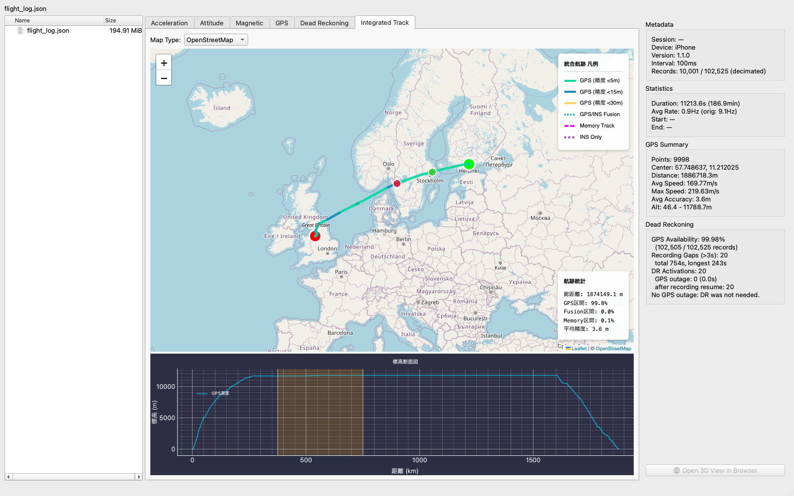
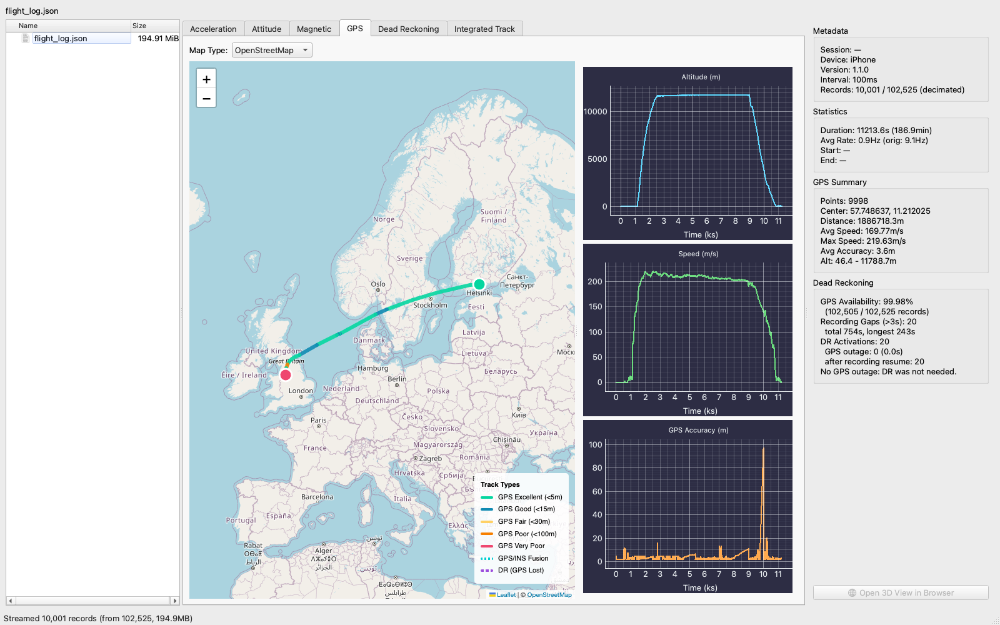
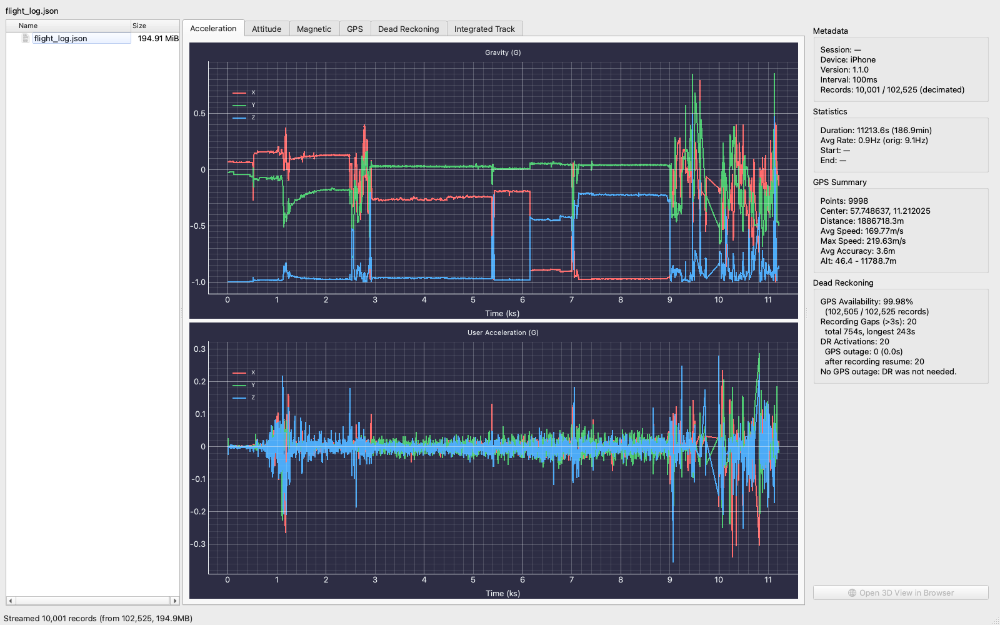
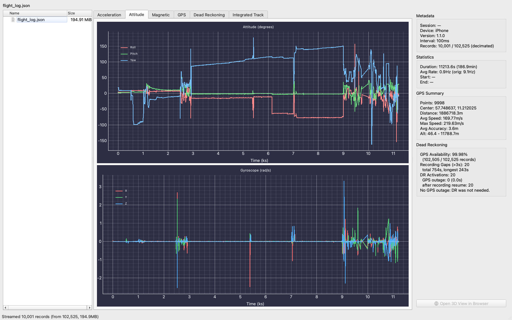
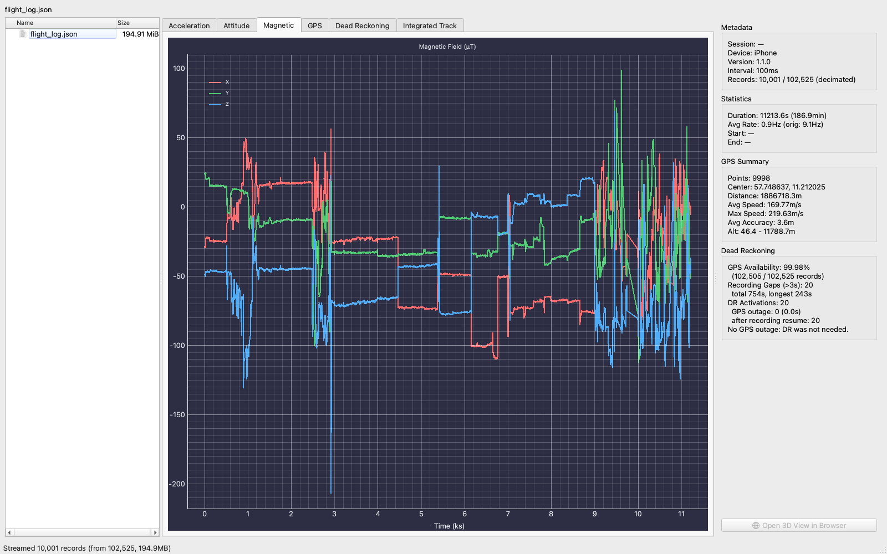
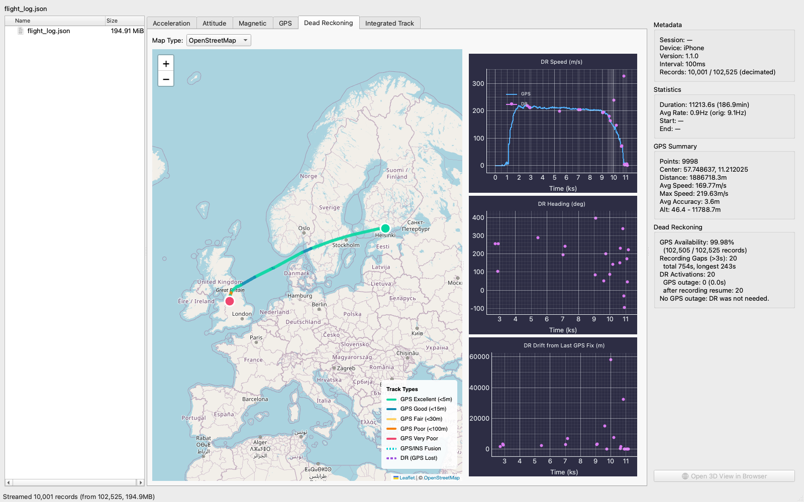
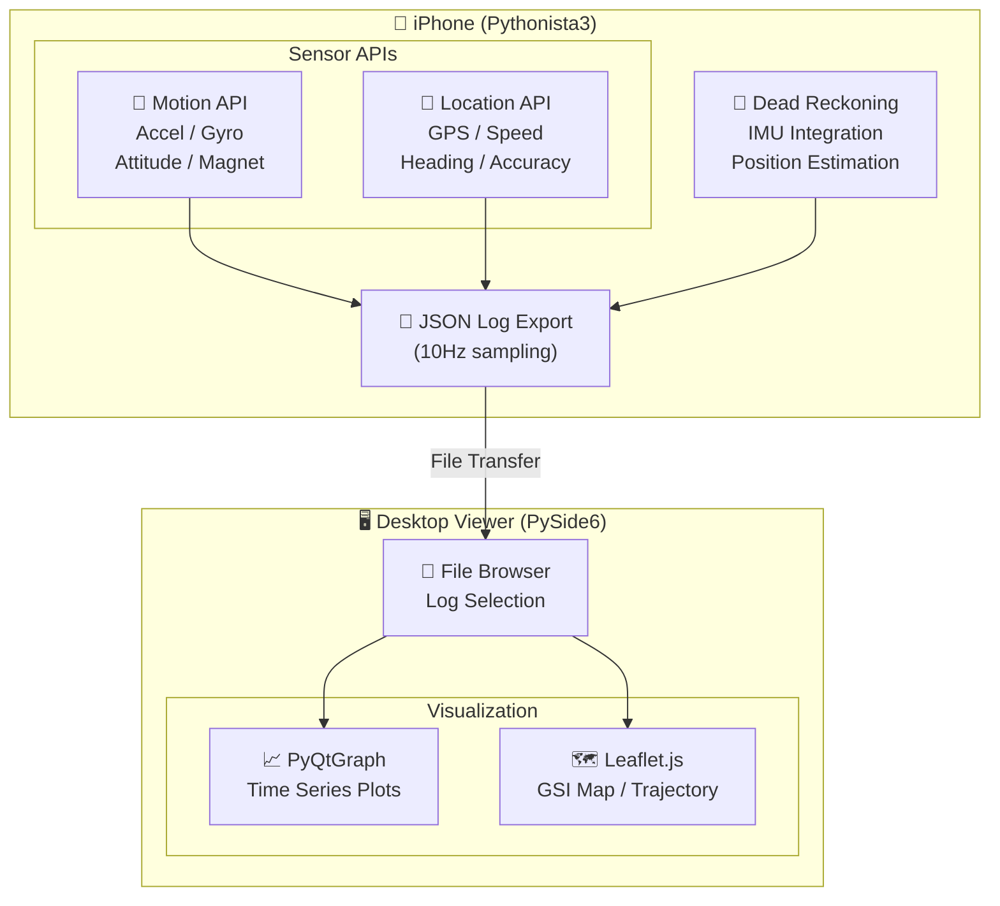

# iPhone G-Sensor Logger & Viewer

iPhoneのモーションセンサー（加速度計、ジャイロスコープ、磁力計）とGPSを使用した高精度センサーログ記録・可視化システム

## Demo

### Sensor Logger (iPhone - Pythonista3)

https://github.com/user-attachments/assets/8bcaa9ff-bb84-4976-832b-16496f7f16e1

**機能:**
- 加速度・ジャイロ・姿勢・磁場をリアルタイム記録
- GPS位置・速度・精度をトラッキング
- OpenStreetMap上でリアルタイム位置表示
- デッドレコニング（GPS途絶時の推測航法）
- JSONフォーマットでログ出力

### Log Viewer (Desktop - PySide6)

https://github.com/user-attachments/assets/036c52fd-8439-4fb0-b0da-9384105489ef

**機能:**
- センサーデータの時系列グラフ表示（PyQtGraph）
- 国土地理院地図上での軌跡表示（Leaflet.js）
- GPS軌跡とデッドレコニング軌跡の比較表示
- インタラクティブな時間軸操作
- ファイルブラウザによるログ選択

## Case Study: 旅客機の機内で記録したログ

フィンランドから英国マンチェスターへ向かう旅客機の機内で記録したログを Log Viewer で表示した例です。記録の開始地点はヘルシンキ・ヴァンター空港、終了地点はマンチェスター空港の構内です。地上を移動する前提で作ったツールが、時速 750 km・高度 11 km という想定外の条件でどこまで使えるか、また何が見えるかの検証を兼ねています。

| 項目 | 値 |
| --- | --- |
| 記録時間 | 186.9 分（11,214 s） |
| レコード数 | 102,525 件（平均 9.1 Hz）、JSON 195 MB |
| 読み込み | ストリーミングで 10,001 件に間引いて表示（約 4 秒） |
| GPS 有効率 | 99.98 %（水平精度の中央値 2.7 m、99 パーセンタイル 10.7 m） |
| 巡航 | GPS 高度の中央値 11,761 m、対地速度の中央値 209 m/s（754 km/h） |
| 飛行距離 | GPS 航跡で 1,872 km（出発地点と到着地点の大圏距離は 1,811 km） |

数値はすべてログの全レコードから算出しています（間引き前）。

### Integrated Track — 航跡と高度断面



- 1,872 km の航跡を GPS 精度で色分けして 1 枚の地図に描きます。機内でも GPS はほぼ途切れず、航跡の 99.8 % が GPS 区間でした。
- 下段の断面図は、横軸を距離 (km)、縦軸を GPS 高度 (m) に固定しています。飛行の段階を断面の形からそのまま読み取れます。
  - 離陸から約 16 分で高度 10,000 m に到達（平均上昇率 約 10 m/s）
  - 約 11.8 km の巡航を 109 分維持
  - 10,000 m から約 25 分かけて着陸
- 断面図のオレンジの区間をドラッグすると、その区間の両端が地図上にマーカーで示されます。高度の変化と地理的な位置を対応づけられます。
- 地形断面（国土地理院の標高タイル）は日本国内しか提供されていないため、国外のログでは取得しません。国内のログでも取得はバックグラウンドで行うので、表示を待たせません。

### GPS — 高度・対地速度・測位精度



- 高度・対地速度・水平精度を同じ時間軸に並べるので、飛行の各段階をグラフから区切れます。
  - 記録開始から 13 分後に地上走行を開始
  - 離陸滑走、上昇、巡航、降下、着陸後の地上走行
- 離陸滑走では、GPS 速度が 10 m/s から 70 m/s まで 26 秒で上がりました。平均加速度は 2.3 m/s²（0.24 G）です。
- 水平精度は機内でも中央値 2.7 m でした。一時的な劣化は降下中に集中しており（最大 約 100 m）、その区間を精度のグラフで特定できます。

### Acceleration — 重力方向とユーザー加速度



- 上段は、端末の座標系で見た重力の方向です。段差状の変化はジャイロのスパイクと同じ時刻に起きています。したがって機体の運動ではなく、端末を置き直した時刻と判断できます。
- 離陸時（t ≈ 1.1 ks）に重力の Y 成分が −0.08 G から −0.51 G まで振れ、上昇が進むにつれて −0.18 G へ戻ります。これは機体のピッチ姿勢と、持続する加速度の一部が重力の推定に混入した分が重なったものと解釈できます。ただし端末の置き方を記録していないため、両者は分離できません。
- 下段は重力を除いたユーザー加速度です。巡航中の大きさは中央値 0.021 G、99 パーセンタイル 0.093 G でした。
- GPS と IMU を同じログに持っていることで、両者を突き合わせて検証できます。たとえば離陸滑走中、IMU が示す前後方向の加速度は平均 0.14 G で、GPS 速度から求めた 0.24 G より小さくなっています。持続する加速度の一部が、姿勢推定の側で重力として扱われていることがわかります。
- 9 ks 以降は着陸前後の端末操作で大きく乱れています。斜めの直線は、記録が欠落した区間の前後を結んだものです。

### Attitude — 姿勢とジャイロ



- 姿勢角とジャイロを上下に並べています。姿勢角の段差がジャイロのスパイクと同じ時刻にあれば端末の操作、スパイクを伴わないゆっくりした変化であれば機体の運動、と切り分ける手がかりになります。
- 巡航中はジャイロがほぼ 0 rad/s で、端末を静置していた区間を特定できます。

### Magnetic — 機内の磁場



- 地球磁場の強さは北欧〜英国で約 50 µT です。これに対し、機内の測定値の大きさは中央値 79 µT、95 パーセンタイル 109 µT でした。値は端末を動かすたびに段差状に変わります。
- 機体の構造や電装品の影響と、端末自身の較正誤差とは区別できません。いずれにせよ、機内では磁気方位に頼る航法が成り立たないことがログから直接わかります。

### Dead Reckoning — GPS 途絶との照合



- 推測航法（DR）は 20 回作動しましたが、**実際に GPS が途絶して作動したものは 0 回**でした。20 回はすべて、記録が 3 秒以上欠落した後、記録が再開された最初のレコードで起きています。再開直後はロガーが保持している GPS の時刻が古いため、タイムアウト（5 秒）と判定されて DR が作動します。
- Viewer は間引く前の全レコードを走査して、次の 2 点を右側のパネルに表示します。記録の欠落区間は、速度グラフに背景色で示します。
  - GPS 有効率と、記録欠落の回数・合計時間（今回は 20 回、計 754 秒）
  - DR が作動した原因の内訳（GPS 途絶か、記録の再開か）
- 最終 GPS 測位点から推測位置までの隔たりは、最大 58 km でした。これは 243 秒の欠落の直後の値で、欠落中に機体が進んだ距離をそのまま反映しています。
- このログから、ロガー側の改善点が 2 つ見つかりました。どちらもロガー v1.2.0 で対応しています。
  - 記録の再開直後を GPS 途絶と誤って判定する。v1.2.0 では、更新が 2 秒以上止まった後の再開を検出し、次のように扱います。
    - GPS のタイムアウトは再開時点から数え直す
    - 新しい測位が届くまでは、停止前の位置を航法に使わない
    - 停止していた時間を積分に使わない（停止中の移動を一度に外挿しない）
    - 停止していた秒数をログの `resumed_after_sec` に記録する
  - DR の方位が 0–360° の範囲に正規化されていない（−94°〜396° の値が出る）
- 記録欠落の原因（アプリの一時停止など）は、ログからは特定できません。

## System Architecture


```mermaid
flowchart TB
    subgraph iPhone["📱 iPhone (Pythonista3)"]
        subgraph Sensors["Sensor APIs"]
            Motion["🎯 Motion API<br/>Accel / Gyro<br/>Attitude / Magnet"]
            Location["📍 Location API<br/>GPS / Speed<br/>Heading / Accuracy"]
        end
        DR["🧭 Dead Reckoning<br/>IMU Integration<br/>Position Estimation"]
        Export["💾 JSON Log Export<br/>(10Hz sampling)"]

        Motion --> Export
        Location --> Export
        DR --> Export
    end

    Export -->|"File Transfer"| Import

    subgraph Desktop["🖥️ Desktop Viewer (PySide6)"]
        Import["📂 File Browser<br/>Log Selection"]
        subgraph Visualization["Visualization"]
            Graph["📈 PyQtGraph<br/>Time Series Plots"]
            Map["🗺️ Leaflet.js<br/>GSI Map / Trajectory"]
        end
        Import --> Graph
        Import --> Map
    end
```

## Requirements

### Sensor Logger (iPhone)
- iPhone with motion sensors
- [Pythonista 3](http://omz-software.com/pythonista/) app

### Log Viewer (Desktop)
- Python 3.10+
- Dependencies listed in `requirements.txt`

## Installation

### Log Viewer Setup

```bash
# Clone repository
git clone https://github.com/YOUR_USERNAME/iPhone-G-Sensor.git
cd iPhone-G-Sensor

# Install dependencies
pip install -r requirements.txt

# Run viewer
python log_viewer.py
```

### Sensor Logger Setup

1. Install Pythonista 3 on your iPhone
2. Copy `g_sensor_app.py` to Pythonista
3. Run the script

## Sensor Data Format

ログファイルはJSON形式で、以下のデータを含みます：

```json
{
  "device_info": {
    "model": "iPhone",
    "system_version": "18.x"
  },
  "records": [
    {
      "timestamp": 1701234567.123,
      "motion": {
        "acceleration": {"x": 0.01, "y": -0.02, "z": -1.0},
        "gravity": {"x": 0.0, "y": 0.0, "z": -1.0},
        "gyroscope": {"x": 0.001, "y": 0.002, "z": 0.0},
        "attitude": {"roll": 0.0, "pitch": 0.0, "yaw": 0.0},
        "magnetic_field": {"x": 25.0, "y": -10.0, "z": 40.0}
      },
      "location": {
        "latitude": 35.6812,
        "longitude": 139.7671,
        "altitude": 40.0,
        "speed": 1.5,
        "course": 90.0,
        "horizontal_accuracy": 5.0
      },
      "dead_reckoning": {
        "latitude": 35.6812,
        "longitude": 139.7671,
        "confidence": 0.95
      }
    }
  ]
}
```

## Features

### Dead Reckoning
GPS信号が途絶した場合（トンネル内、屋内など）、IMUデータ（加速度計・ジャイロスコープ）を積分して位置を推定する機能を搭載しています。

### Map Integration
- **記録時（iOS）**: OpenStreetMapでリアルタイム位置表示
- **再生時（Desktop）**: 国土地理院淡色地図上でGPS軌跡（青）とデッドレコニング軌跡（紫）を重ねて表示

### Barometric Altimeter (未実装)
iPhoneには気圧高度計（CMAltimeter）が搭載されていますが、本アプリでは使用していません。Pythonista3環境ではCMAltimeterのコールバック処理が安定せず、アプリのクラッシュや不正確なデータ取得が発生するためです。将来的にネイティブアプリとして実装する際には対応を検討します。

## License

MIT License

## Acknowledgments

- [OpenStreetMap](https://www.openstreetmap.org/) - 地図タイル提供（iOS）
- [国土地理院](https://maps.gsi.go.jp/) - 地図タイル提供（Desktop）
- [Leaflet.js](https://leafletjs.com/) - 地図ライブラリ
- [PyQtGraph](https://www.pyqtgraph.org/) - グラフ描画ライブラリ
- [Pythonista 3](http://omz-software.com/pythonista/) - iOS Python IDE
